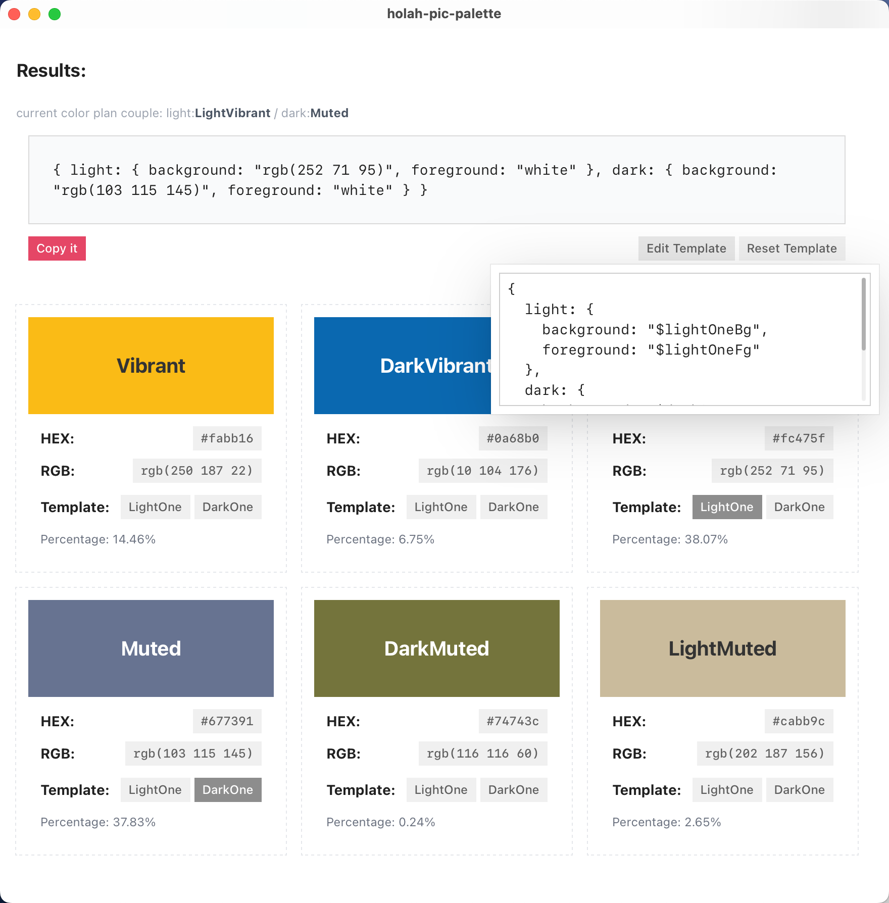

# holah-pic-palette

A desktop application for generating color schemes from images. Built with Tauri, React, and TypeScript.



## Features

- **Color Extraction**: Automatically extracts vibrant, muted, and other color variations from the pasted image
- **Theme Generation**: Select colors for light and dark themes with a single click
- **Template Customization**: Edit the output template to match your project's needs
- **Copy Results**: Easily copy the generated color scheme to use in your projects

## How to Use

1. **Paste an Image**: Click on the paste area and press Ctrl+V to paste an image
2. **View Color Palette**: The application will automatically extract a color palette from the image
3. **Select Theme Colors**: Click on the "LightOne" or "DarkOne" button under any "color card" to select it for your theme
4. **Customize Template**: Click "Edit Template" to modify the output format
5. **Copy Results**: Click "Copy it" to copy the generated color scheme to your clipboard

## Development

### Prerequisites

- Node.js (v20.10.0 or later)
- Rust (v1.86 or later)
- pnpm

### Setup

```bash
# Clone the repository
git clone https://github.com/ninohx96/pic-palette-desktop.git
cd pic-palette-desktop

# Install dependencies
pnpm install

# Run in development mode
pnpm tauri-dev
```

### Building

```bash
# Build for production
pnpm tauri-build
```

## Technical Details

- **Frontend**: React, TypeScript, Radix UI, Tailwind CSS
- **Backend**: Rust, Tauri
- **Color Extraction**: node-vibrant
- **File Handling**: Tauri's file system API

## README.zh

[中文文档](./README.zh.md)
